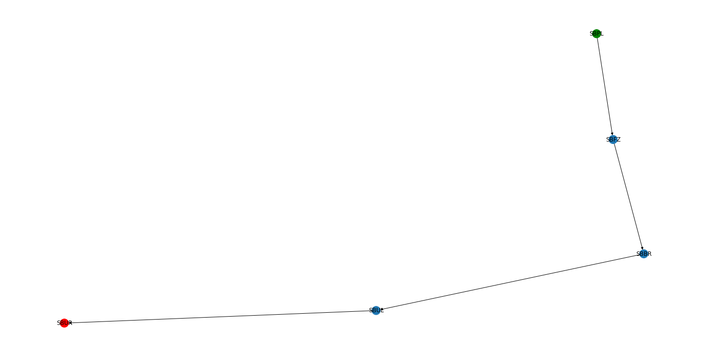

# Airline Routes

**Número da Lista**: 1<br>
**Conteúdo da Disciplina**: Grafos 1<br>

## Alunos
|Matrícula | Aluno |
| -- | -- |
| 16/0133505  |  Lucas Gomes Silva |
| 19/0134623  |  Marcos Diego da Silva Gomes |

## Sobre 
O projeto tem como objetivo utilizar o conceito de grafos no ambiente de viagens aéreas para definir as opções de vôos, dado um aeroporto de origem e de destino. Utilizando a busca em largura (BFS) é demonstrado ao usuário as opções de aeroportos pelos quais passar para alcançar o aeroporto de destino.

## Screenshots
#### Grafo completo

#### Árvore de nós visitados pelo BFS

#### Caminho percorrido do nó inicial ao nó final


## Instalação 
**Linguagem**: Python<br>
É necessário ter instalado o **Python** e o **pip** para executar o projeto (é recomendado utilizar um ambiente virtual para instalar e executar o projeto).

- Para instalar o gerenciador de pacotes pip:<br>
    ``` sudo apt-get install python3-pip ```
    
- Clone o repositório:<br>
    ``` git clone https://github.com/projeto-de-algoritmos/Grafos1_AirlineRoutes ```

- Instale as bibliotecas necessárias:<br>
    ``` pip install -r requirements.txt ```

## Uso 
### Para executar o projeto
Após estar dentro da pasta do projeto e com todas as bibliotecas instaladas, existe os seguintes passos para visualização do projeto: <br>
1. Execute o comando para abrir o jupyter-notebook:
    ``` jupyter notebook ```
2. Com a aba do jupyter aberta no navegador, abra o arquivo **AirlineRoutes.ipynb**.
    2.1 Para uma melhor experiência, vá em Kernel e depois em "Restart and Clear Output".
3. Na aba superior tem um menu chamado "Cell". Clicando nele, vai ter a opção "Run All", onde executará todas as células do arquivo.
    3.1 Ou se preferir, é possível ir em Kernel e depois "Restart and Run All".
4. Na célula 16 é possível alterar a origem e destino do voo.
5. Na célula 12 e 18 é possível descomentar a linha e visualizar a Lista de Adjacências e a Árvore resultante da BFS, respectivamente.

## Outros 
Dados de viagens aéreas coletados pela Agência Nacional de Aviação Civil (ANAC) e é utilizado voos das empresas LATAM e AZUL.


